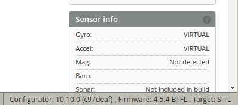
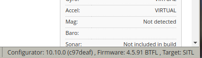

# test

before 



```
betaflight_4.5/src/main/build/version.h
29:#define FC_VERSION_PATCH_LEVEL      4  // increment when a bug is fixed

** change **
29:#define FC_VERSION_PATCH_LEVEL      91  

```

```
  # Rebuild (ccache makes this ~10-20s on a one-line edit :
  make -C /mnt/betab/sitl build BF_SRC=/mnt/betab/betaflight_4.5


Linking SITL 
lto-wrapper: warning: using serial compilation of 4 LTRANS jobs
lto-wrapper: note: see the '-flto' option documentation for more information
/usr/bin/ld: warning: obj/main/betaflight_SITL.elf has a LOAD segment with RWX permissions
   text	   data	    bss	    dec	    hex	filename
 291748	  16456	  73832	 382036	  5d454	./obj/main/betaflight_SITL.elf
Creating HEX ./obj/betaflight_4.5.91_SITL.hex 
make[1]: Leaving directory '/src'

Built: /mnt/betab/betaflight_4.5/obj/main/betaflight_SITL.elf
-rwxr-xr-x 1 user user 367K May 14 14:40 /mnt/betab/betaflight_4.5/obj/main/betaflight_SITL.elf
make: Leaving directory '/mnt/betab/sitl'
```


```
  # Restart SITL:
  make -C /mnt/betab/sitl run   BF_SRC=/mnt/betab/betaflight_4.5   
```





## rev


